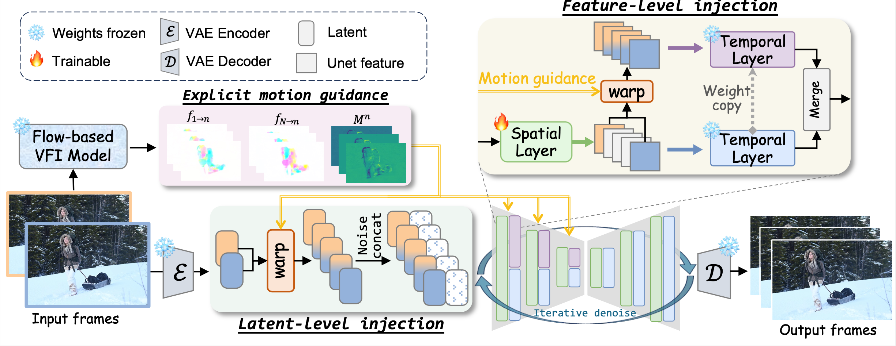

## ___***Motion-Aware Generative Frame Interpolation [arxiv](https://arxiv.org/pdf/2501.03699)***___

<div align="center">


 <a href='https://arxiv.org/abs/2501.03699'></a> &nbsp;
 <a href='https://mcg-nju.github.io/MoG_Web/'>

[Guozhen Zhang](https://github.com/GuozhenZhang1999), [Yuhan Zhu](https://scholar.google.com/citations?user=ydgR3LgAAAAJ&hl=en), [Yutao Cui](https://scholar.google.com.hk/citations?user=TSMchWcAAAAJ&hl=zh-CN), Xiaotong Zhao, [Kai Ma](https://scholar.google.com.hk/citations?user=FSSXeyAAAAAJ&hl=zh-CN), [Limin Wang](http://wanglimin.github.io/)
<br>
From Nanjing University and Tencent PCG.
</div>

> MoG is a generative video frame interpolation (VFI) model, designed to synthesize intermediate frames between two input frames.
> MoG is the first VFI framework to bridge the gap between flow-based stability and generative flexibility. We introduce a dual-level guidance injection design to constrain generated motion using motion trajectories derived from optical flow. To enhance the generative model's ability to dynamically correct flow errors, we implement encoder-only guidance injection and selective parameter fine-tuning. As a result, MoG achieves significant improvements over existing open-source generative VFI methods, delivering superior performance in both real-world and animated scenarios.

<div align="center">
  
</div>


## 🔥 News

* **[2025.3] Inference code released.**

## 🍀 Showcases

### 1.1 Real-World Scenes

<table class="center">
    <tr style="font-weight: bolder;text-align:center;">
        <td>Input starting frame</td>
        <td>Input ending frame</td>
        <td>Generated video</td>
    </tr>
  <tr>
  <td>
    
  </td>
  <td>
    
  </td>
  <td>
    
  </td>
  </tr>


   <tr>
  <td>
    
  </td>
  <td>
    
  </td>
  <td>
    
  </td>
  </tr>
  <tr>
    <td>
    
  </td>
  <td>
    
  </td>
  <td>
    
  </td>
  </tr> 
</table>

### 1.2 Animation Scenes

<table class="center">
    <tr style="font-weight: bolder;text-align:center;">
        <td>Input starting frame</td>
        <td>Input ending frame</td>
        <td>Generated video</td>
    </tr>
  <tr>
    <td>
    
  </td>
  <td>
    
  </td>
  <td>
    
  </td>
  </tr>


   <tr>
    <td>
    
  </td>
  <td>
    
  </td>
  <td>
    
  </td>
  </tr>
  <tr>
    <td>
    
  </td>
  <td>
    
  </td>
  <td>
    
  </td>
  </tr> 
</table>

## 🛠️ Installation

> CUDA 12.1

```bash
cd MoG
bash install.sh
```

## 🛫	Inference

1. **Place the Model Checkpoint:**

   - Download `ani.ckpt` and `real.ckpt` from [HuggingFace](https://huggingface.co/MCG-NJU/MoG/tree/main) and put them in the `MoG/checkpoints`.
   - Download `ours_t.ckpt` from [this link](https://drive.google.com/drive/folders/16jUa3HkQ85Z5lb5gce1yoaWkP-rdCd0o) and place it in the `MoG/emavfi/ckpt`.

2. **Run the Default Test Code:**
  > To lower the consumption of GPU memory, you can remove the comments at lines 333-334 of the `MoG/scripts/evaluation/inference.py` for using FP16.

   - For animated scenes testing, execute the following command:

     ```bash
     source scripts/run_ani.sh
     ```

   - For real-world scenes, use:

     ```bash
     source scripts/run_real.sh
     ```

3. **Check Results:**

   - Upon successful execution, results will be generated in the `results/ani_test123` folder for animated scenes testing and `results/real_test123` for real-world scenes. Due to the randomness inherent in sampling, the output may not be identical on each run.

4. **Customize Your Test Samples:**

   - **Create a New Folder:**
     - In the `prompts` directory, create a new folder named `X`.
   - **Add Frames:**
     - Place the input frames for interpolation in the `X` folder. You can include multiple pairs (e.g., `1_0.png`, `1_1.png`, `2_0.png`, `2_1.png`). Ensure that the filenames correspond to the interpolation order.
   - **Create a Prompt File:**
     - In the `X` folder, create a file named `prompt.txt`. Each line should describe the content you want to generate for each pair of frames (e.g., for `1_0.png`, `1_1.png`, `2_0.png`, `2_1.png`, write two lines, one for each pair). The descriptions can be brief, but must be included.
   - **Modify the Script:**
     - Edit `scripts/run_ani.sh` (or `run_real.sh` for real scenes). Change the `prompt_dir` parameter to point to your new folder `prompts/X`. You can also adjust the `name` parameter to specify the output name in the `results` folder.
   - **Run the Script**

## 🔑	Citation

If you think this project is helpful in your research or for application, please feel free to leave a star⭐️ and cite our paper:

```
@article{zhang2025motion,
  title={Motion-Aware Generative Frame Interpolation},
  author={Zhang, Guozhen and Zhu, Yuhan and Cui, Yutao and Zhao, Xiaotong and Ma, Kai and Wang, Limin},
  journal={arXiv preprint arXiv:2501.03699},
  year={2025}
}
```

## ☕️	License and Acknowledgement

This project is released under the Apache 2.0 license.

❤️ The codes are based on [DynamiCrafter](https://github.com/Doubiiu/DynamiCrafter) for real-world scenes and [ToonCrafter](https://github.com/Doubiiu/ToonCrafter) for animation scenes. Please also follow their licenses. Thanks for their awesome works.
